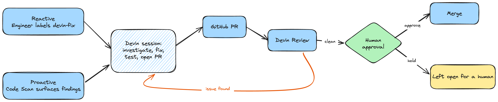

# Devin Remediation Control Plane

A **team-level remediation queue** built on the Devin API. Every team has work that's
important but expensive to context-switch into — security findings, dependency upgrades,
on-call cleanup, tech debt. This turns Devin into a **first-pass engineer** for that
queue: an engineer decides what to delegate and reviews the result; Devin does the
investigation, the fix, the tests, and the PR.

The point: it turns Devin from an individual tool an engineer opens into a **team-level
workflow** — a shared handoff, a human approval gate, and visibility across every run.

Target for this demo: a fork of [Apache Superset](https://github.com/apache/superset).

Everything here runs from **one command** (`docker compose up`) and reproduces in
**mock mode for $0, no credentials** — flip one env var for live Devin.

---

## Overview

The hard part of remediation usually isn't knowing *what* to fix — it's the engineering
time each item costs: context-switch in, understand the code, make the change, test it,
open a reviewable PR. This system lets an engineer delegate that first pass to Devin.

Work enters the queue two ways:
- **Reactive** — an engineer labels a GitHub issue `devin-fix` (e.g. something picked up on call).
- **Proactive** — Devin's Code Scan surfaces security findings; the engineer prioritizes which to hand off.

Both converge on one flow: **finding → Devin investigates → fix + tests → PR → human
review.** Devin ships the primitives natively (Code Scans, Automations, Playbooks,
Metrics); this project is the thin layer that composes them into a governed team
workflow — each fix implemented by a Devin session, independently reviewed (Devin Review
+ a human) before merge, and tracked on a control plane. Where review surfaces a
correctness issue, the change goes back to Devin to iterate rather than merging as-is
(e.g. PRs #10 and #13). The goal isn't to maximize autonomous merges — it's to maximize
the engineering work that can be safely automated behind a human approval gate.

## Architecture



**A fix starts one of two ways:**
1. **Reactive — an engineer labels an issue** `devin-fix` → Devin picks up that specific
   issue. The GitHub issue is the interface; the label is the handoff.
2. **Proactive — Devin's Code Scan surfaces findings** → the engineer prioritizes and hands
   the ones worth it to Devin. The scan runs **on-demand** (`POST /scan`) or on a schedule;
   lower-confidence findings are surfaced for human triage rather than auto-fixed.

From there it's one flow: a **Devin session** investigates, fixes, tests, and opens a
**PR** → **Devin Review** analyzes it → a **human approves and merges**, or holds it. If
review finds an issue, it loops back to Devin to self-correct.

A **FastAPI control plane** (this repo) runs it all: it triggers the scan pipeline and,
via a **continuous background loop**, **reconciles every session (any origin) from the
Devin API** and **auto-triggers Devin Review on each new PR** — so review is part of the
automation (not a manual `/devin review`), and the **dashboard** reflects reality, not
just what this process launched. (The event trigger is a native Devin Automation
provisioned via `scripts/setup_devin.py`; the periodic trigger is the control plane's own
scheduler running `/scan` on a cadence. Devin's native auto-review can also be toggled on
in Settings → Review as a complement.)

## Results

- **7 curated findings → 7 remediation PRs**, 7/7 merged after review.
- **Devin Review caught a correctness bug** in the timezone remediation and drove a second iteration (Devin self-corrected).
- The **Slack remediation surfaced a backend-compatibility tradeoff** that required human judgment (left open with the tradeoff documented + tests added).
- **Devin Code Scan independently discovered** additional findings and opened a fix (semantic-layer secret masking).
- The **scheduled automation was exercised end-to-end** (trigger fired).
- Devin fixed dependencies the *correct* way (edited the `uv` source constraint and recompiled) and verified the deck.gl upgrade by **running the app in a browser**.

## Quickstart — mock mode ($0, no key, how a grader runs it)

```bash
cp .env.example .env          # defaults = mock mode
docker compose up --build
# in another terminal:
curl -X POST localhost:8000/scan          # or: python scripts/simulate.py
```
Open the control plane: **http://localhost:8000/dashboard** (JSON: `/metrics`).

Mock mode simulates the full Devin lifecycle (scan → findings → remediation sessions →
PRs → review → ACU cost) so the entire system runs and demos offline.

## Go live (real scans, PRs, reviews)

1. Create a Devin PAT: **app.devin.ai → Settings → Devin API → PATs** (`cog_…`).
2. Install the **Devin.ai GitHub App** on your fork with write on Code/PRs/Issues/Checks
   (set it to **all repositories** so public-repo automation events are delivered).
3. In `.env`: `DEVIN_MODE=live`, `DEVIN_API_KEY=cog_…`, `DEVIN_ORG_ID=org-…`, `TARGET_REPO=you/superset`.
4. **Provision the Devin resources** (Playbook, Knowledge, the event Automation), idempotent:
   ```bash
   DEVIN_API_KEY=$DEVIN_API_KEY DEVIN_ORG_ID=$DEVIN_ORG_ID TARGET_REPO=you/superset \
     python scripts/setup_devin.py
   ```
5. *(optional)* recreate the curated issue set on your fork:
   ```bash
   REPO=you/superset bash seed_issues/seed_issues.sh
   ```
6. `docker compose up`, then trigger any of:
   - **event:** add the `devin-fix` label to an issue
   - **on-demand:** `curl -X POST localhost:8000/scan`
   - **periodic:** set `WEEKLY_SCAN_ENABLED=true` so the control plane runs `/scan` on a cadence

## The seeded issues (scanner-found on real Superset mainline)

| # | Type | Finding |
|---|------|---------|
| 1 | dependency CVE | `python-multipart` → ≥0.0.30 (HIGH ReDoS) |
| 2 | dependency CVE | `jaraco.context` → ≥6.1.0 (HIGH path traversal) |
| 3 | dependency CVE | frontend `brace-expansion` HIGH (npm) |
| 4 | code + tests | eliminate the unsafe-`Markup` XSS class + regression test |
| 5 | code quality | timezone-naive datetime in `daos/key_value.py` |
| 6 | code quality | narrow blind `except` in `utils/slack.py` |
| 7 | dependency (breaking) | deck.gl/loaders.gl major upgrade (HIGH npm) — the hard case |

Plus issues **Devin's Code Scan discovers on its own** via `POST /scan`.

## Observability

`/dashboard` (auto-refreshing) is composed from the local store and Devin's native
**Metrics API**:
- **Remediation funnel**: findings → dispatched → PRs opened → **merged**
- **Autonomy rate** (autonomous vs. needs-a-human) and **merge rate**
- **Estimated** engineer-hours saved — a labeled assumption (PRs × a per-fix estimate),
  not a measured value
- Risk-by-severity and a per-remediation table (severity → Devin session → PR), live log

ACU/cost is available via Devin's **Consumption API** on Teams/Enterprise plans; on a
Free account that API returns 0, so cost is omitted rather than shown as `$0`.

## Project layout

```
app/
  main.py         FastAPI app; POST /scan, dashboard, health, DB init
  config.py       env settings (DEVIN_MODE is the big switch)
  scans.py        orchestrator: scan → findings → remediate → auto-review → track
  sync.py         reconcile ALL Devin sessions (any origin) into the store
  store.py        SQLite: scan_runs, remediations, events
  observability.py  /metrics + /dashboard (local + native metrics)
  devin/          Devin v3 client: interface + live + mock
scripts/
  setup_devin.py  idempotently provision Playbook + Knowledge + the event Automation
  simulate.py     one-command trigger for graders/demo
seed_issues/
  *.md            the 7 curated issue bodies (the use case)
  seed_issues.sh  file them onto a fork + create the devin-fix label
tests/            unit tests for the core logic (pip install pytest && pytest)
```

## Devin platform surface used

Sessions · **Code Scans** · **Automations** (event trigger) · **Playbooks** ·
**Knowledge** · **Devin Review** · **Metrics** · **Consumption**. (Dynamic Workflows &
MCP integrations noted as next steps.)

## Design rationale

Dependency bots automate deterministic changes; this system targets the reasoning-heavy
part of remediation. A Devin session reads the code, implements the fix, writes a
regression test, runs the repo's lint/tests, iterates, and opens the PR — then Devin
Review analyzes it. Sessions honor the repo's own `AGENTS.md` and the provisioned
Playbook (e.g. dependency fixes edit the `uv` source constraint and recompile rather than
hand-editing the pin). The intended boundary: bounded, test-verifiable fixes land
autonomously; wide-blast-radius or visual changes (e.g. the deck.gl upgrade) route to a
human — and the dashboard makes that split visible.

## Next steps (real engagement)

Human-in-the-loop approval gate before merge · multi-repo fleet view · route reports to
Slack/Jira/Notion via **MCP** · express the audit→fix→verify pipeline as a native
**Dynamic Workflow** · richer analytics (MTTR & cost per severity) from the Metrics API.
